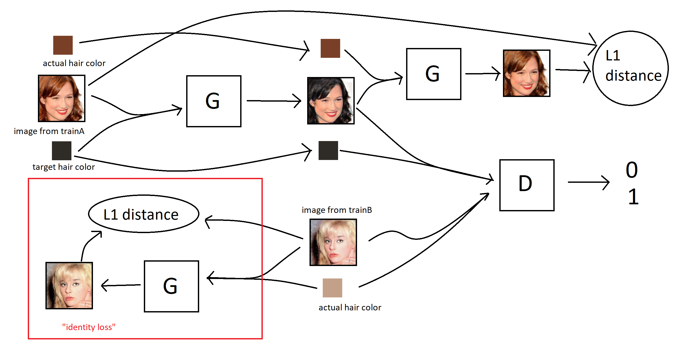
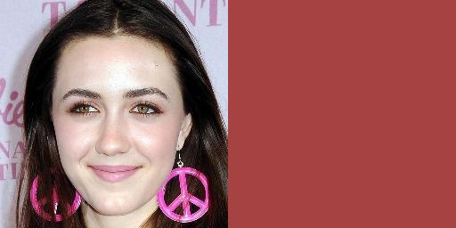

# haircolorGAN

We implement a variation of the cycleGAN architecture (described in [this paper](https://arxiv.org/pdf/1703.10593.pdf)) that allows changing between multiple hair colors in portrait images. We build on the [PyTorch implementation of pix2pix and cycleGAN](https://github.com/junyanz/pytorch-CycleGAN-and-pix2pix) by [Jun-Yan Zhu](https://github.com/junyanz), [Taesung Park](https://github.com/taesung) and [Tongzhou Wang](https://ssnl.github.io/). The modified cycleGAN architecture is sketched in the following diagram. 




In contrast to the original cycleGAN, it uses only one generator and one discriminator. Both generator and discriminator take hair color labels as additional input. For more details see my [project report](https://cs230.stanford.edu/past-projects/) and [poster](https://cs230.stanford.edu/past-projects/) for the Stanford CS230 class. (hyperlinks to be updated.)

Specifically I have added the following files:

- [haircolor_gan_model.py](models/haircolor_gan_model.py) - - implements the haircolorGAN model
- [hair_dataset.py](data/hair_dataset.py) - - data loader to load images and target hair colors for training
- [hair_testmode_dataset.py](data/hair_testmode_dataset.py) - - data loader for testing with specific pairs of (image,target hair color)
- [hair_list_A.json](datasets/haircolor/hair_list_A.json), [hair_list_B.json](datasets/haircolor/hair_list_B.json) - - these contain hair color labels for images from the [CelebAMask-HQ](https://github.com/switchablenorms/CelebAMask-HQ) dataset which is used for training. The hair color labels were computed using the masks that are provided with the dataset.

I have also made modifications to the following files:

- [networks.py](models/networks.py) - - added the "SigmoidDiscriminator" discriminator architecture
- [train.py](train.py) - - made minor change in order to allow saving images multiple times per epoch during training.
- [visualizer.py](util/visualizer.py) - - disabled auto refresh for the html reports generated during training.

For more information on the code structure consider reading the [Readme of the original code base](docs/original_README_pix2pix_and_cyclegan.md) and the [Overview of Code Structure](docs/overview.md).


### Preparing the data

We use the [CelebAMask-HQ](https://github.com/switchablenorms/CelebAMask-HQ) dataset for training. Download the dataset by following the hyperlink. The dataset contains 30.000 images of celebrities. Please rescale all of these images so that they have a resolution of 256x256. Make sure that the filenames are 0.jpg, 1.jpg, 2.jpg etc. Then (after cloning this repo) place the images in [datasets/haircolor/images](datasets/haircolor/images). I have included three example images in that directory. 

### Training

After preparing the data as described above, you can start training the model with the following command:
```bash
python train.py --model haircolor_gan --dataroot datasets/haircolor --name experiment1
```
Some of the options you may want to change:

`--netG` , `--netD` : network architecture for generator and discriminator. Use `--netG resnet_6blocks` for slightly faster training (default is 9 residual blocks rather than 6). Use `--netD basic`for a PatchGAN discriminator (default is Sigmoid Discriminator).

`--num_colors_to_match` , `--num_mc_drawings` : larger values lead to a greater difference between input hair color and target hair color (on average) in the training examples. Use `--num_mc_drawings 0 --num_colors_to_match 1` to sample input images and target hair colors independently

`--lambda_cyc` `--lambda_identity` : weight that is assigned to reconstruction loss and identity loss.

`--name` you can use any name for the experiment. `experiment1` is just an example. 

To see intermediate results during training, have a look at `./checkpoints/experiment1/web/index.html`.

### Testing with your own choice of images and target hair colors

To test your trained model with your own choice of images and target hair colors, you need to populate a directory `./datasets/haircolor_test/test` with image pairs of the following form. Each image is of size 256x512 pixels. The leftmost 256x256 pixels contain your input image. The other pixels on the right are in the target hair color. Here is an example:



This is the same format that is used for the input data of the [pix2pix](models/pix2pix_model.py) model. The authors have provided the script `datasets/combine_A_and_B.py` to help us prepare our data like this. To use it, create directories `./datasets/haircolor_test/A/test` and `./datasets/haircolor_test/B/test`. Put your input images (of resolution 256x256) into  `./datasets/haircolor_test/A/test` and your target hair colors (which need to be images of size 256x256, like the right half of the above example) into `./datasets/haircolor_test/B/test`. The file names of each input image and the corresponding target hair color that you want to use with it have to be the same, e.g. the target hair color for `./datasets/haircolor_test/A/test/1.jpg` is `./datasets/haircolor_test/B/test/1.jpg`. Then navigate to the directory  `./datasets` and run 
```bash
python combine_A_and_B.py --fold_A haircolor_test/A --fold_B haircolor_test/B --fold_AB haircolor_test
```
This will create the folder `haircolor_test/test` and fill it with the combined images.

After having prepared your data like this, run `test.py` like this:
```bash
python test.py --model haircolor_gan --dataroot datasets/haircolor_test --dataset_mode hair_testmode --eval --name experiment1
```
You may want to adjust the options `--netG`, `--no_dropout` and `--norm` to match your generator model that you have trained. You can also use the `--epoch` option to load a model from an earlier epoch during training, if it has been saved in `./checkpoints/experiment1`.

You will see the results in the directory `./results/experiment1/test_latest`. Or, if you have specified a value for `--epoch` then the word `latest` will be replaced by that value.

Feel free to also use a different name than `haircolor_test` for the directory that contains the data. We only used the name `haircolor_test` as an example throughout this section. 


### Testing with a pre-defined test subset of CelebAMask-HQ

Alternatively you can use the default data loader ([hair_dataset.py](data/hair_dataset.py)) also with `test.py`. During training, it uses only the first 12.000 images of each of `datasets/haircolor/hair_list_A.json` and `datasets/haircolor/hair_list_B.json`. You can test with the remaining approximately 2.000 images in `datasets/haircolor/hair_list_A.json` by running

```bash
python test.py --model haircolor_gan --dataroot datasets/haircolor --eval --name experiment1
```
As described in the previous section, the results of running `test.py` will be saved to `./results/experiment1/test_latest`.

